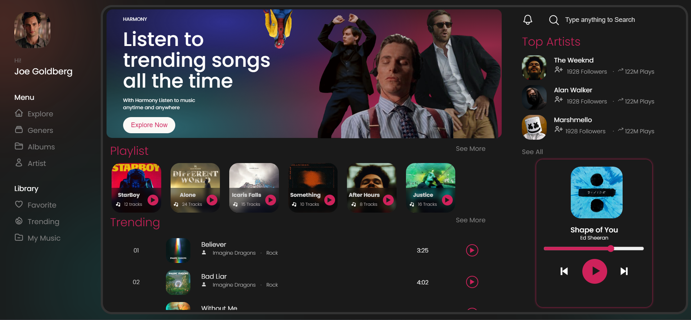

# Music App UI

This is a non-responsive music app UI designed to work specifically on 1440p screens. It's built using pure HTML, CSS, and JavaScript.

## Preview



Preview Link: https://music-app-ui.cyberpirate.repl.co/#

## Features

- Visual representation of the currently playing track
- Non-responsive design optimized for 1440p screens

## Installation

1. Clone this repository:
   ```bash
   git clone https://github.com/your-username/music-app-ui.git

